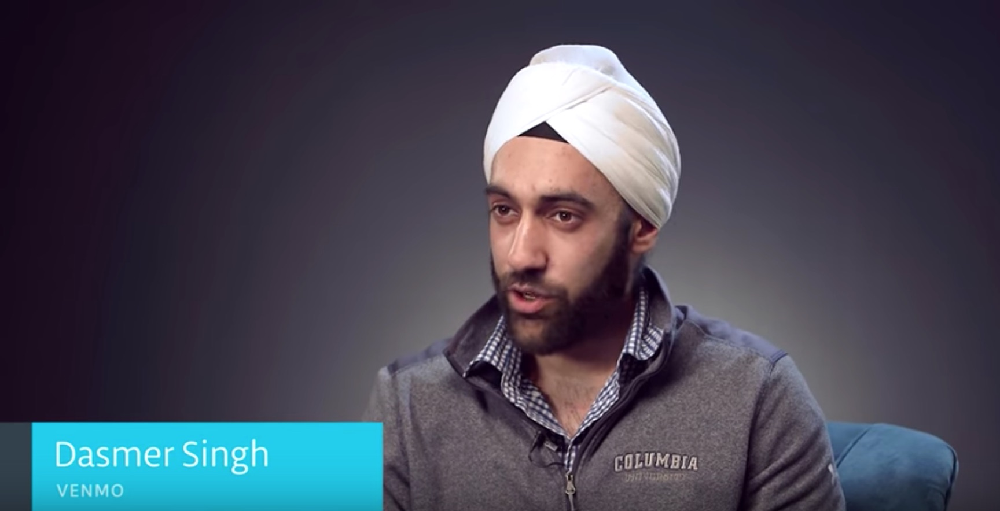
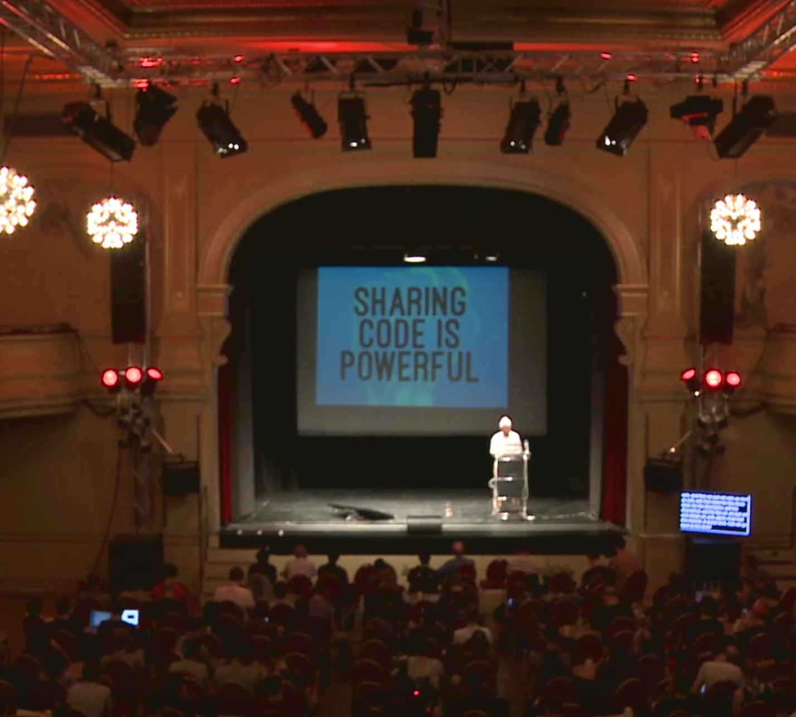
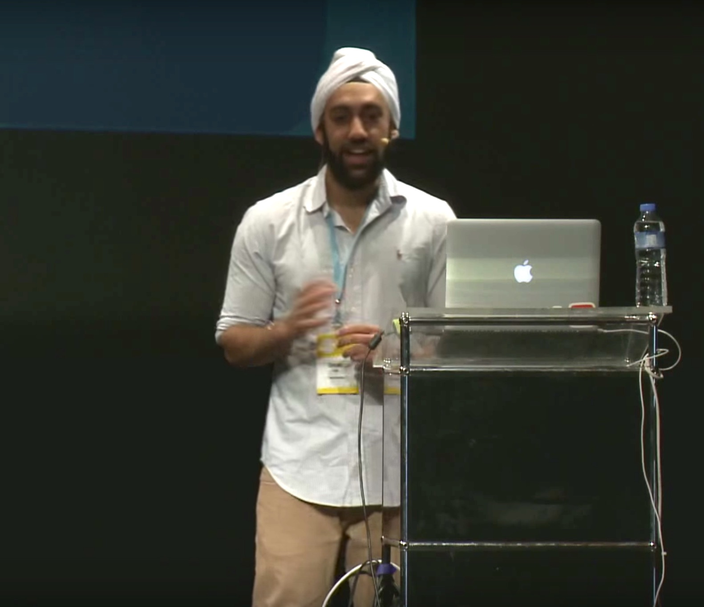

One of my goals is to speak at more places and events.

## Upcoming Events

| Date        | Role | Event | Location | Talk Title (if applicable) |
| ----------- | ----- | ----- | ----- | -------- |
| 01 June 2017 | Speaker | Flatiron Product Series | The Flatiron School, New York  | The Workflows of Product Management |
| 29 March 2017 | Speaker | Venmo Guest Speaker Event - [Columbia ADI][15] | Columbia University,  New York  | Transitioning to Product |

If you'd like me to speak at a panel, competition or conference, email me at <dasmersingh@gmail.com>.

## Past Events

| Date        | Role | Event | Location | Talk Title (if applicable) |
| ----------- | ----- | ----- | ----- | -------- |
| 02 March 2017 | Speaker | iOS Technical Guest Lecture | The Flatiron School, New York | [Building Emoji Autocomplete][16] |
| 15 November 2016 | Judge | [Fast Pitch Competition][1] | | Columbia University,  New York | - |
| 10 October 2016 | Speaker | [The Wizardest Podcast][13a] | New York, NY | Product Management, Mobile Engineering, and iOS 10 |
| 5 September 2016 | Speaker | [iOSDevUK][1] | Aberystwyth, UK | Hey Siri, Let's Connect |
| 23 May 2016 | Speaker | [UIKonf][8a] | Berlin, Germany | Build Once Use Everywhere ([Slides][8c]) |
| 16 April 2016 | Judge | [FinTech Pitch Competition][7] | Columbia University,  New York | - |
| 01 April 2016 | Panelist | Yale MBA Tech Club Job Trek | Venmo HQ,  New York | - |
| 23 March 2016 | Panelist | Starting a Startup - AKPsi Panel | Columbia University,  New York | - |
| 14 March 2016 | Interviewee | [Objective-C for Swift Developers by Udacity][9] | Mountain View,  California | [Objective-C vs Swift][10], [Common Interop Challenges][11] |
| 04 March 2016 | Panelist | [CORE Circles][5] | Venmo HQ, New York | - |
| 30 November 2015 | Technical Advisor | [Lion Hack][6] |Columbia University,  New York | - |
| 03 April 2015 | Panelist | Moving Up the Internship Ladder - AKPsi Panel |Columbia University,  New York |- |
| 29 August 2014 | Speaker | [A Swift Start][3] | The Flatiron School, New York | [Learn From Thy Users][4] |
| 21 July 2014 | Speaker | [iOS Devs NYC][2] | The Flatiron School, New York | Integrate the Venmo SDK |

[1]: http://www.iosdevuk.com/
[2]: http://www.meetup.com/iOS-Devs-NYC/events/194385732/
[3]: http://aswiftstart.com/
[4]: https://speakerdeck.com/dasmer/learn-from-thy-users
[5]: http://coreatcu.com/corecircles
[6]: http://columbiaentrepreneurs.org/CEONEW2015/lion-hack-cbs-2015/
[7]: https://www.evensi.us/core-fintech-amp-social-entrepreneurship-elevator-pitch/175092386
[8a]: http://www.uikonf.com
[8b]: https://www.youtube.com/watch?v=JbIoI7sm4_o&t=37m0s
[8c]: https://speakerdeck.com/dasmer/build-once-use-everywhere
[9]: https://www.udacity.com/course/objective-c-for-swift-developers--ud1009
[10]: https://classroom.udacity.com/courses/ud1009/lessons/7813929061/concepts/79651565980923
[11]: https://classroom.udacity.com/courses/ud1009/lessons/8087838321/concepts/81452688740923
[12]: https://www.youtube.com/watch?v=JbIoI7sm4_o
[13a]: https://wizardest.com/tagged/podcast
[13b]: https://wizardest.com/wizardest-podcast-episode-1-dasmer-singh-product-manager-at-venmo-fc7fea62ff42#.4tajek5lz
[14]: https://www.eventbrite.com/e/columbia-fast-pitch-competition-2016-registration-29058471671?aff=erelexpmlt
[15]: https://adicu.com/
[16]: http://share.snacktools.com/959B5A59E8C/bh3212q8
